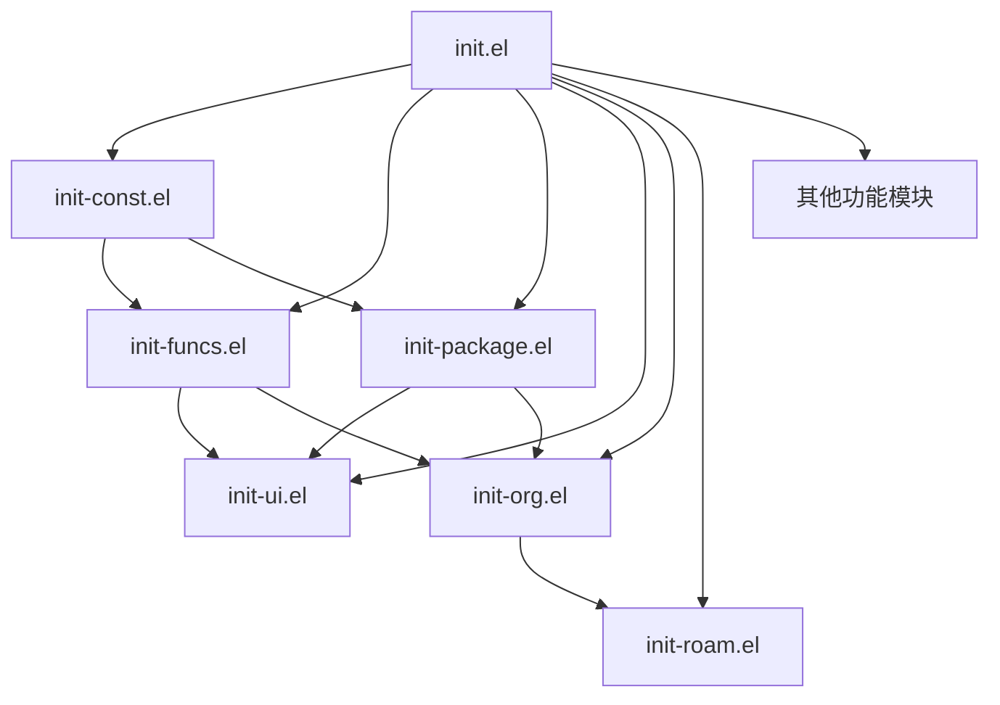

# Emacs 配置项目 Code Wiki

## 1. 项目概述

这是一个高度定制化的 Emacs 配置项目，旨在提供一个功能丰富、性能优化的 Emacs 开发环境。该配置以 Org-mode 和 Org-roam 为核心，构建了一个个人知识管理系统，同时集成了多种编程语言支持、UI 美化和工作流优化。

### 主要功能特性

- **性能优化**：启动速度和运行效率优化
- **现代化 UI**：美观的界面和主题系统
- **知识管理**：基于 Org-roam 的个人知识网络
- **多语言支持**：Python、Rust、C 等编程语言的集成
- **高效工作流**：代码补全、版本控制、文件管理等
- **个性化配置**：模块化设计，易于扩展和定制

## 2. 目录结构

项目采用清晰的模块化结构，将不同功能的配置分离到独立的文件中，便于维护和扩展。

```
.emacs.d/
├── extends/           # 扩展工具和库
│   └── emacs-module.h
├── lisp/             # 核心配置模块
│   ├── init-base.el  # 基础配置
│   ├── init-org.el   # Org-mode 配置
│   ├── init-roam.el  # Org-roam 配置
│   └── ...           # 其他功能模块
├── load-lisp/        # 第三方扩展
│   ├── ob-rust/      # Rust 代码块支持
│   ├── org-novelist/ # 小说写作工具
│   └── org-roam/     # 知识管理系统
├── snippets/         # 代码片段
│   └── org-mode/     # Org-mode 代码片段
├── init.el           # 配置入口点
└── README.org        # 项目说明
```

### 目录说明

| 目录/文件          | 作用                            | 详细说明                                         |
|-------------------|--------------------------------|------------------------------------------------|
| extends/          | 扩展工具和库                    | 包含 plantuml.jar 等外部工具                    |
| lisp/             | 核心配置模块                    | 包含所有功能的配置文件                          |
| load-lisp/        | 第三方扩展                      | 包含 org-roam、ob-rust 等自定义或第三方扩展     |
| snippets/         | 代码片段                        | 包含各种模式的代码片段                          |
| init.el           | 配置入口点                      | 加载所有配置模块                                |
| README.org        | 项目说明                        | 项目文档和使用说明                              |

## 3. 系统架构与主流程

### 配置加载流程

1. **启动初始化**：Emacs 启动时加载 init.el
2. **性能优化**：设置 GC 阈值和文件处理优化
3. **路径配置**：更新 load-path，添加 lisp 和 load-lisp 目录
4. **核心依赖**：加载常量定义和工具函数
5. **包管理**：初始化包管理器和配置
6. **功能模块**：按顺序加载各个功能模块
7. **语言支持**：加载编程语言相关配置

### 模块依赖关系



## 4. 核心模块

### 4.1 基础配置 (init-base.el)

提供 Emacs 的基础配置，包括编辑器行为、文件处理、键盘绑定等。

### 4.2 常量定义 (init-const.el)

定义系统常量和环境变量，如系统类型检测、包镜像源等。

**主要常量**：
- `sys/winntp`、`sys/linuxp`、`sys/macp`：系统类型检测
- `tuna-elpa`、`ustc-elpa`：国内包镜像源

### 4.3 工具函数 (init-funcs.el)

提供各种实用工具函数，如文件操作、字体检测、编译工具等。

**主要函数**：
- `font-available-p`：检测字体是否可用
- `delete-this-file`：删除当前文件并关闭缓冲区
- `rename-this-file`：重命名当前文件和缓冲区
- `update-packages`：更新所有包

### 4.4 包管理 (init-package.el)

配置 Emacs 包管理器，设置包源和 use-package 配置。

**主要配置**：
- 设置包镜像源为清华源
- 配置 use-package 选项
- 自动更新包

### 4.5 UI 配置 (init-ui.el)

配置 Emacs 的用户界面，包括主题、字体、模型线等。

**主要功能**：
- 隐藏菜单和工具栏
- 配置字体和主题
- 启用 doom-modeline
- 配置窗口行为

### 4.6 Org-mode 配置 (init-org.el)

配置 Org-mode，包括待办事项、日程安排、代码块执行等。

**主要功能**：
- 配置 Org 目录和文件
- 自定义待办事项状态
- 配置议程视图
- 支持多种代码块语言

### 4.7 Org-roam 配置 (init-roam.el)

配置 Org-roam 知识管理系统，包括笔记创建、链接管理、数据库同步等。

**主要功能**：
- 配置 Org-roam 目录和数据库
- 定义捕获模板
- 配置日常笔记
- 集成 deft 快速搜索

### 4.8 其他功能模块

- **init-completion.el**：代码补全配置
- **init-edit.el**：编辑功能增强
- **init-vcs.el**：版本控制系统集成
- **init-lsp.el**：语言服务器协议配置
- **init-python.el**：Python 语言支持
- **init-rust.el**：Rust 语言支持

## 5. 关键函数与变量

### 5.1 核心函数

| 函数名 | 功能描述 | 所在文件 |
|--------|----------|----------|
| `update-load-path` | 更新 load-path，添加自定义目录 | [init.el](file:///Users/dylan/workspace/myconfig/.emacs.d/init.el#L34-L37) |
| `add-subdirs-to-load-path` | 递归添加子目录到 load-path | [init.el](file:///Users/dylan/workspace/myconfig/.emacs.d/init.el#L39-L42) |
| `font-available-p` | 检测字体是否可用 | [init-funcs.el](file:///Users/dylan/workspace/myconfig/.emacs.d/lisp/init-funcs.el#L19-L21) |
| `delete-this-file` | 删除当前文件并关闭缓冲区 | [init-funcs.el](file:///Users/dylan/workspace/myconfig/.emacs.d/lisp/init-funcs.el#L24-L32) |
| `rename-this-file` | 重命名当前文件和缓冲区 | [init-funcs.el](file:///Users/dylan/workspace/myconfig/.emacs.d/lisp/init-funcs.el#L34-L45) |
| `update-packages` | 更新所有包 | [init-funcs.el](file:///Users/dylan/workspace/myconfig/.emacs.d/lisp/init-funcs.el#L116-L122) |
| `childframe-workable-p` | 检查子框架是否可用 | [init-funcs.el](file:///Users/dylan/workspace/myconfig/.emacs.d/lisp/init-funcs.el#L103-L110) |
| `org-summary-todo` | 根据子任务状态更新父任务状态 | [init-org.el](file:///Users/dylan/workspace/myconfig/.emacs.d/lisp/init-org.el#L95-L99) |

### 5.2 关键变量

| 变量名 | 作用 | 所在文件 |
|--------|------|----------|
| `gc-cons-threshold` | 垃圾回收阈值，影响性能 | [init.el](file:///Users/dylan/workspace/myconfig/.emacs.d/init.el#L14) |
| `package-archives` | 包镜像源 | [init-package.el](file:///Users/dylan/workspace/myconfig/.emacs.d/lisp/init-package.el#L17) |
| `use-package-always-ensure` | 自动安装缺失的包 | [init-package.el](file:///Users/dylan/workspace/myconfig/.emacs.d/lisp/init-package.el#L28) |
| `org-directory` | Org 文件目录 | [init-org.el](file:///Users/dylan/workspace/myconfig/.emacs.d/lisp/init-org.el#L52) |
| `org-agenda-files` | 议程文件列表 | [init-org.el](file:///Users/dylan/workspace/myconfig/.emacs.d/lisp/init-org.el#L53-L54) |
| `org-roam-directory` | Org-roam 目录 | [init-roam.el](file:///Users/dylan/workspace/myconfig/.emacs.d/lisp/init-roam.el#L53) |
| `org-roam-db-gc-threshold` | Org-roam 数据库 GC 阈值 | [init-roam.el](file:///Users/dylan/workspace/myconfig/.emacs.d/lisp/init-roam.el#L54) |

## 6. 依赖关系

### 6.1 核心依赖

| 依赖 | 用途 | 来源 |
|------|------|------|
| use-package | 包管理和配置框架 | ELPA |
| org | 组织模式和知识管理 | GNU ELPA |
| org-roam | 知识网络管理 | 本地 load-lisp |
| doom-modeline | 现代化模型线 | ELPA |
| nerd-icons | 图标支持 | ELPA |
| modus-themes | 主题系统 | ELPA |
| ef-themes | 额外主题 | ELPA |
| circadian | 自动主题切换 | ELPA |

### 6.2 语言支持

| 依赖 | 用途 | 来源 |
|------|------|------|
| ob-rust | Rust 代码块支持 | 本地 load-lisp |
| ob-python | Python 代码块支持 | Org 内置 |
| ob-mermaid | Mermaid 图表支持 | ELPA |
| plantuml-mode | PlantUML 支持 | ELPA |

## 7. 配置与运行

### 7.1 安装与配置

1. **克隆仓库**：
   ```bash
   git clone https://github.com/zucchiniy/.emacs.d.git ~/.emacs.d
   ```

2. **安装依赖**：
   - Emacs 27.1 或更高版本
   - 必要的外部工具：
     - PlantUML (用于图表生成)
     - Mermaid CLI (用于流程图生成)
     - 字体：Iosevka Nerd Font、LXGW WenKai Mono 等

3. **首次启动**：
   - 首次启动时，Emacs 会自动安装所需的包
   - 可能需要等待一段时间完成包的下载和安装

### 7.2 快捷键

#### 全局快捷键

| 快捷键 | 功能 | 模块 |
|--------|------|------|
| `SPC o a` | 打开 Org 议程 | init-org.el |
| `SPC o c` | Org 捕获 | init-org.el |
| `SPC n f` | 查找 Org-roam 节点 | init-roam.el |
| `SPC n i` | 插入 Org-roam 节点 | init-roam.el |
| `SPC n l` | 切换 Org-roam 缓冲区 | init-roam.el |
| `SPC d j` | 捕获今日笔记 | init-roam.el |
| `SPC d k` | 跳转到今日笔记 | init-roam.el |

#### 模式特定快捷键

- **Org 模式**：
  - `C-c C-t`：切换待办事项状态
  - `C-c C-s`：安排日程
  - `C-c C-d`：设置截止日期
  - `C-c C-l`：插入链接

- **Org-roam 模式**：
  - `C-c n f`：查找节点
  - `C-c n i`：插入节点
  - `C-c n c`：捕获节点

## 8. 开发与扩展

### 8.1 添加新模块

1. 在 `lisp/` 目录下创建新的配置文件，如 `init-new-feature.el`
2. 在 `init.el` 中添加 `(require 'init-new-feature)`
3. 使用 `use-package` 配置新功能

### 8.2 自定义配置

- **个人配置**：可以在 `custom.el` 中添加个人定制
- **环境变量**：在 `init-const.el` 中添加环境特定的常量
- **快捷键**：在相应的模块中使用 `general-define-key` 添加快捷键

### 8.3 性能优化

- **启动优化**：
  - 使用 `use-package` 的 `:defer` 选项延迟加载
  - 优化 `gc-cons-threshold`
  - 减少启动时的文件处理

- **运行时优化**：
  - 启用原生编译
  - 优化字体渲染
  - 减少不必要的模式和钩子

## 9. 总结与亮点

### 9.1 项目亮点

1. **模块化设计**：清晰的模块分离，便于维护和扩展
2. **性能优化**：多项启动和运行时优化，提升 Emacs 性能
3. **现代化 UI**：美观的界面和主题系统，提升用户体验
4. **知识管理**：基于 Org-roam 的强大知识网络管理
5. **多语言支持**：集成多种编程语言的支持
6. **个性化配置**：丰富的自定义选项，满足不同用户需求

### 9.2 适用场景

- **知识工作者**：通过 Org-roam 构建个人知识管理系统
- **开发者**：支持多种编程语言，提供高效的开发环境
- **学生和研究员**：用于笔记、论文写作和项目管理
- **任何需要高效文本处理的用户**：Emacs 的强大编辑能力和定制性

### 9.3 未来发展

- 进一步优化性能和启动速度
- 添加更多语言和工具的集成
- 改进 Org-roam 的使用体验
- 增加更多实用的工作流和工具

## 10. 附录

### 10.1 常用命令

| 命令 | 功能 | 模块 |
|------|------|------|
| `org-roam-node-find` | 查找 Org-roam 节点 | init-roam.el |
| `org-roam-capture` | 捕获新的 Org-roam 节点 | init-roam.el |
| `org-agenda` | 打开 Org 议程 | init-org.el |
| `org-capture` | 捕获新的 Org 条目 | init-org.el |
| `update-packages` | 更新所有包 | init-funcs.el |
| `byte-compile-elpa` | 编译 ELPA 包 | init-funcs.el |

### 10.2 故障排除

- **包安装失败**：检查网络连接，尝试切换包镜像源
- **启动缓慢**：检查 `init.el` 中的配置，减少不必要的启动项
- **Org-roam 数据库问题**：运行 `org-roam-db-sync` 同步数据库
- **字体显示问题**：确保安装了所需的字体，如 Iosevka Nerd Font

### 10.3 相关资源

- [Org-mode 官方文档](https://orgmode.org/)
- [Org-roam 文档](https://www.orgroam.com/)
- [Emacs Wiki](https://www.emacswiki.org/)
- [Doom Emacs](https://github.com/doomemacs/doomemacs) (参考了部分配置理念)

---

本文档由 Dylan Yang 维护，基于项目的当前状态生成。如有任何问题或建议，请联系作者。